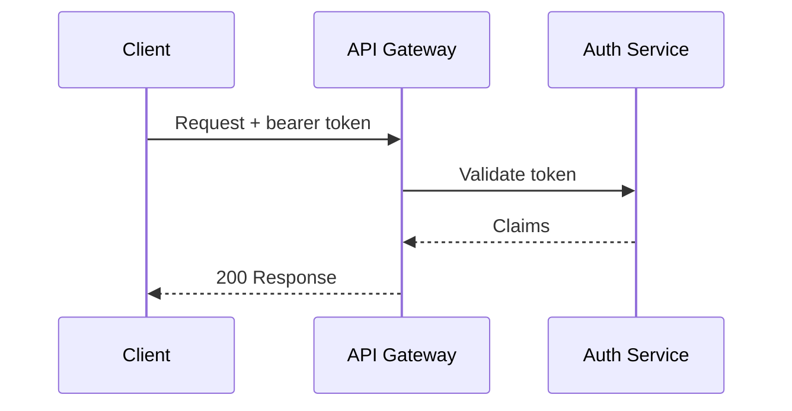

# API Gateway Security Review

This report summarizes the findings of the Q2 security review of the API
gateway. Metadata such as the title, version, and the DRAFT watermark come
from this file's frontmatter; everything organization-wide (author, style,
page setup) comes from `company-config.yaml`.

## Scope

The review covered the public gateway endpoints, the authentication flow, and
the rate-limiting configuration. Internal service-to-service traffic was out
of scope.

## Authentication flow

The gateway validates bearer tokens before forwarding requests upstream:

*Note: the block above renders as a code listing for now; once the Mermaid
transformer is registered in the pipeline it will render as a diagram.*

## Findings

| ID | Severity | Finding |
|----|----------|---------|
| GW-01 | High | Rate limits are not applied to authenticated clients |
| GW-02 | Medium | Token expiry is not enforced on cached validations |
| GW-03 | Low | Verbose error responses leak upstream service names |

## Recommendations

1. Apply per-client rate limits regardless of authentication state.
2. Cap the token validation cache TTL at the token's own expiry.
3. Replace upstream error bodies with generic gateway responses.
