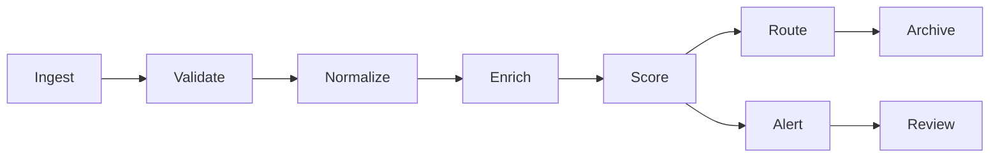
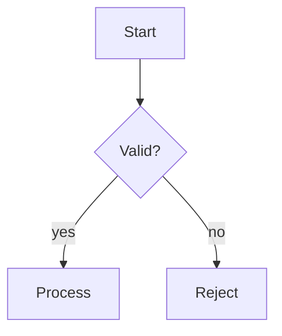

# Diagram Scaling Sample

Two diagrams of very different natural widths, with `mermaid.scale` set as a
bare numeric frontmatter key (the only numeric key; everything else must be a
quoted string). Wide diagrams must not be compressed to unreadable symbols
and narrow ones must not blow up to fill the page — both render at their
natural size times the scale factor.

## A wide pipeline

## A narrow decision

